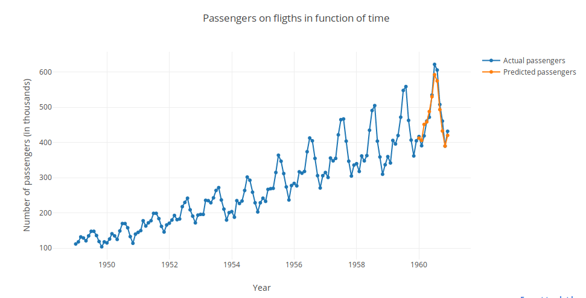

# Flight passengers prediction with tensorflow

In this project I used a recurrent neural network to predict the number of passengers for the next year. The used data set for the project can be found [here](https://datamarket.com/data/set/22u3/international-airline-passengers-monthly-totals-in-thousands-jan-49-dec-60#!ds=22u3&display=line). Unfortunately the plotly plots are not displayed directly through git, hence the result of the model can be seen below, interactively can be accessed through jupyter notebook.

